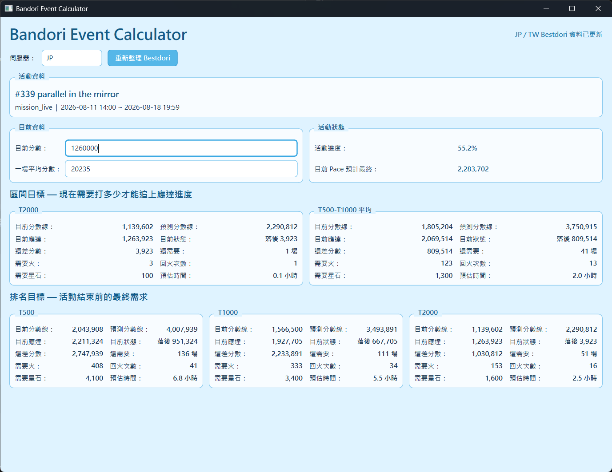

# Bandori Event Calculator

[English](README.md) | [繁體中文](README_zh-TW.md)

A Windows desktop calculator for tracking **BanG Dream! Girls Band Party!** event pace using live event data from [Bestdori](https://bestdori.com/).

The application retrieves event cutoffs and Bestdori predictions, then calculates how much Event Point progress is needed to reach selected ranking and pace targets.

When no event is currently active, the calculator automatically falls back to the most recently completed event so you can still review the final cutoffs and compare them with your own score.

## Features

- Windows desktop GUI built with PySide6
- JP and TW server support
- Automatic current-event detection
- Automatic fallback to the most recently completed event when no event is active
- Automatic Bestdori data loading on startup
- Manual Bestdori refresh
- Cached JP/TW data for instant server switching
- Current cutoff display
- Bestdori predicted cutoff display for active events
- Final cutoff display for completed events
- Event progress calculation
- Live countdown to event end, updated every second
- Event start/end times displayed in the computer's local timezone
- Current pace projected final score
- Ranking target calculations
- Pace / interval target calculations
- Ahead / behind comparison in both Event Points and equivalent games
- Required games calculation
- Required boosts calculation
- Required boost refills
- Required stars
- Estimated play time
- Separate JP and TW player progress
- Persistent player settings across application restarts
- Portable `settings.json` suitable for synchronization with Synology Drive or other cloud storage

## Supported Ranking Targets

### JP

Ranking targets:

- T500
- T1000
- T2000

Pace benchmarks:

- T2000
- Average of T500 and T1000 predictions

### TW

Ranking targets:

- T100
- T500
- T1000

Pace benchmarks:

- Average of T100 and T500 predictions
- Q1 between T100 and T500

## Screenshots



## How It Works

The calculator retrieves event information from Bestdori and combines it with two values entered by the user:

- **Current Score** — your current Event Points
- **Average Score per Game** — the average Event Points earned per game

For an active event, the application calculates two types of targets.

### Pace Targets

Pace targets answer:

> How much do I need to play now to catch up with the expected progress at the current point of the event?

The expected score is calculated from:

```text
Predicted Final Score × Current Event Progress
```

The calculator then shows:

- Current cutoff
- Predicted cutoff
- Expected score at the current event progress
- Whether you are ahead or behind
- Point difference
- Equivalent game difference / requirement
- Required boosts
- Required refills
- Required stars
- Estimated play time

If you are already ahead of a target, the calculator keeps the difference visible so you can see approximately how many games of buffer you currently have.

### Ranking Targets

Ranking targets answer:

> How much more do I need to play before the event ends to reach the predicted final cutoff?

These calculations use the predicted final score as the target.

### Event Countdown

While an event is active, the **Event Status** panel shows a live countdown such as:

```text
3 days 3 hours 12 minutes 31 seconds
```

The countdown updates every second without reloading Bestdori data every second.

After the event ends, the status changes to `Ended`.

### Completed Events

If there is no currently active event on the selected server, the application automatically displays the most recently completed event using the same calculator layout.

For completed events:

- Event progress is shown as `100.0%`
- Event countdown is shown as `Ended`
- The final Bestdori cutoff is used in place of a future prediction
- You can enter your final score and compare it directly against the event's final ranking cutoffs
- Ahead / behind calculations, equivalent games, boosts, refills, stars, and estimated play time remain available

This makes it possible to review how your final result compared with the previous event even after it has disappeared from the active-event list.

## Local Timezone Support

Event start and end timestamps are converted to the **computer's current local timezone**.

For example, if Windows is set to Taiwan time, the application displays Taiwan-local timestamps. If you travel and Windows automatically switches to another timezone, the displayed event times change accordingly.

The underlying event progress and countdown calculations use absolute timestamps, so changing timezone does not change the actual remaining duration of an event.

## Player Settings

Player input is saved automatically to:

```text
settings.json
```

The file is stored next to `BandoriEventCalculator.exe`.

Example:

```json
{
    "JP": {
        "current_score": 1243245,
        "average_score": 20235
    },
    "TW": {
        "current_score": 0,
        "average_score": 0
    }
}
```

Because the settings file is portable, the application can be placed inside a synchronized folder such as Synology Drive:

```text
Synology Drive/
└── Bandori Event Calculator/
    ├── BandoriEventCalculator.exe
    └── settings.json
```

This allows player progress to be shared across multiple computers.

> Avoid editing the same `settings.json` from multiple computers at the same time, as this may cause synchronization conflicts.

## Download

Prebuilt Windows releases are available from the GitHub **Releases** page.

Download:

```text
BandoriEventCalculator.exe
```

No Python installation is required for the prebuilt Windows version.

When the application starts, it automatically retrieves the latest JP and TW event information from Bestdori.

## Development

### Requirements

- Python 3.10+
- PySide6
- Playwright
- Chromium
- requests

Clone the repository:

```powershell
git clone https://github.com/shes95202/bandori-event-calculator.git
cd bandori-event-calculator
```

Create a virtual environment:

```powershell
python -m venv .venv
.\.venv\Scripts\Activate.ps1
```

Install the project:

```powershell
pip install -e .
```

Install Playwright Chromium:

```powershell
playwright install chromium
```

Run the GUI:

```powershell
bandori-event-calculator-gui
```

or:

```powershell
python run_gui.py
```

## Tests

Install the development dependencies if needed:

```powershell
pip install -e ".[dev]"
```

Run the test suite with:

```powershell
pytest
```

## Building the Windows Executable

Install PyInstaller:

```powershell
pip install pyinstaller
```

Bundle Chromium for Playwright:

```powershell
$env:PLAYWRIGHT_BROWSERS_PATH="0"
playwright install chromium
```

Build the application:

```powershell
pyinstaller --noconfirm --clean --onefile --windowed `
    --name BandoriEventCalculator `
    --icon assets/icon.ico `
    --add-data "assets/icon.ico:assets" `
    run_gui.py
```

The executable will be created at:

```text
dist/BandoriEventCalculator.exe
```

Before publishing a release, launch the executable from `dist/` and verify that Bestdori loading, JP/TW switching, calculations, the event countdown, and the application icon all work correctly.

## Application Data

The application stores different types of data in different locations.

### Player Progress

Stored next to the executable:

```text
settings.json
```

This file can be synchronized between computers.

### Playwright Browser Profile

The Chromium profile used for Bestdori is stored locally on each Windows computer:

```text
%LOCALAPPDATA%\BandoriEventCalculator\playwright-profile
```

The browser profile is intentionally not stored next to the executable and does not need to be synchronized.

## Known Limitations

- Challenge Live-specific calculations are not implemented yet.
- Bestdori prediction retrieval depends on the current Bestdori Event Tracker website structure.
- The current prebuilt release targets Windows.
- An internet connection is required when retrieving Bestdori data.

## Data Source

Event information, cutoff data, and predictions are retrieved from:

**Bestdori**

This project is an independent tool and is not affiliated with Bestdori, Bushiroad, Craft Egg, or BanG Dream!.

## Version

Current release:

```text
v0.3.1
```
